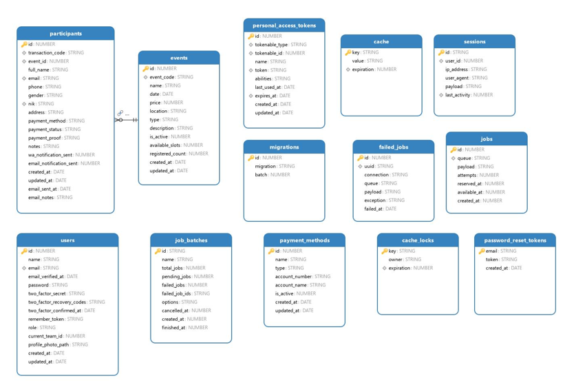

# 🎫 Event Management Platform


## 📝 Deskripsi Project
**Event Management** adalah sebuah platform yang dirancang untuk memudahkan baik user maupun admin dalam melakukan pendaftaran serta pengelolaan event. Platform ini memberikan kemudahan akses dengan tampilan yang terbilang baik dan *user friendly*. Selain itu, platform ini didesain sedemikian rupa untuk memudahkan pengelolaan event baik untuk skala kecil, menengah, atau besar.

---

## 📊 Database Schema & Documentation

### ERD Diagram
Berikut adalah *Entity Relationship Diagram* (ERD) yang menunjukkan struktur dan relasi antar tabel:



> **Catatan:** Sistem menggunakan database relasional untuk mengelola pendaftaran, transaksi, dan operasional sistem secara otomatis.

### 📂 Penjelasan Tabel

#### 1. Modul Utama (Core)
* **`events`**: Menyimpan detail acara.
    * `event_code`: Kode unik identitas event.
    * `available_slots` & `registered_count`: Untuk kontrol kuota peserta.
* **`participants`**: Data pendaftar yang terhubung ke event.
    * Info personal (nama, email, phone, nik, gender).
    * Tracking pembayaran (`payment_status`, `payment_proof`).
    * Log notifikasi (`wa_notification_sent`, `email_notification_sent`).

#### 2. Autentikasi & Pengguna
* **`users`**: Data admin/staf pengelola. Mendukung fitur keamanan seperti *Two-Factor Authentication* (2FA) dan role.
* **`personal_access_tokens`**: Token untuk akses API (Laravel Sanctum).
* **`password_reset_tokens`**: Penyimpanan token sementara untuk reset kata sandi.

#### 3. Infrastruktur & Pembayaran
* **`payment_methods`**: Master data metode pembayaran (Nama bank, nomor rekening, status aktif).
* **`sessions`**: Menyimpan data sesi login user.
* **`cache` & `cache_locks`**: Optimasi kecepatan akses data dan penguncian proses.

#### 4. Queue & Log System
* **`jobs` & `job_batches`**: Mengelola proses background (seperti pengiriman email massal).
* **`failed_jobs`**: Mencatat proses antrean yang gagal.
* **`migrations`**: Rekam jejak perubahan struktur database.

### 🔗 Relasi Utama (Key Relationships)

| Hubungan | Tabel Asal | Tabel Tujuan | Kunci (Foreign Key) |
| :--- | :--- | :--- | :--- |
| **One to Many** | `events` | `participants` | `event_id` |
| **One to Many** | `users` | `sessions` | `user_id` |
| **Polymorphic** | `users`/`others` | `personal_access_tokens` | `tokenable_id` |

### 💡 Atribut Penting (Business Logic)
1.  **Pendaftaran**: Setiap peserta di tabel `participants` memiliki `transaction_code` unik untuk verifikasi.
2.  **Keamanan**: Penggunaan `two_factor_secret` pada tabel `users` untuk proteksi ekstra admin.
3.  **Manajemen Kuota**: Validasi `available_slots` dilakukan sebelum record pendaftar baru dibuat.

---

## 👥 Role & Permission

### 1. Peserta (Public)
**Path:** `/`  
Role paling umum dengan fitur penunjang pencarian dan pendaftaran.
* ✅ Melakukan pendaftaran event.
* ✅ Mencari event aktif.
* ✅ Cek status pendaftaran via kode transaksi.

### 2. Admin (Internal)
**Path:** `/admin`  
Wewenang penuh untuk manajemen operasional sistem.
* ✅ Monitoring dashboard & statistik.
* ✅ CRUD Event & Manajemen Peserta.
* ✅ Verifikasi pembayaran & Kirim Email QR Code.
* ✅ Manajemen Metode Pembayaran.

---

## 🛠 Teknologi yang Digunakan

| Komponen | Teknologi |
| :--- | :--- |
| **Backend** | Laravel 12 |
| **Frontend** | Livewire, Tailwind CSS, Vite |
| **Database** | MySQL |
| **Library Utama** | Maatwebsite Excel, Js QrCode, Font Awesome |
| **Security** | Laravel Fortify & Jetstream |

---

## 🚀 Instalasi

### Prerequisites
* PHP >= 8.2
* Composer & Node.js (NPM)
* MySQL Server

### Langkah Instalasi

1. Clone repository
```bash
git clone https://github.com/training-solonet/event_management.git
cd event_management
```

2. Install dependencies
```bash
composer install
npm install
```

3. Setup environment
```bash
cp .env.example .env
php artisan key:generate
```

4. Konfigurasi database di file `.env`
```env
DB_CONNECTION=mysql
DB_HOST=127.0.0.1
DB_PORT=3306
DB_DATABASE=pos_sanjaya
DB_USERNAME=root
DB_PASSWORD=
```

5. Jalankan migrasi database
```bash
php artisan migrate
```

6. Build assets
```bash
npm run build
# atau untuk development
npm run dev
```

7. Jalankan aplikasi
```bash
php artisan serve
```

Aplikasi akan berjalan di `http://localhost:8000`

## Development

### Running Development Server
```bash
# Terminal 1 - Laravel
php artisan serve

# Terminal 2 - Vite
npm run dev
```

### Code Quality
```bash
# Fix PHP code style
./vendor/bin/pint

